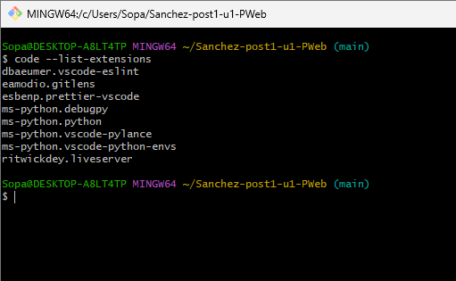
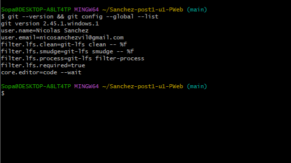
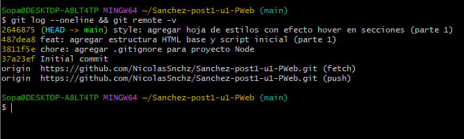
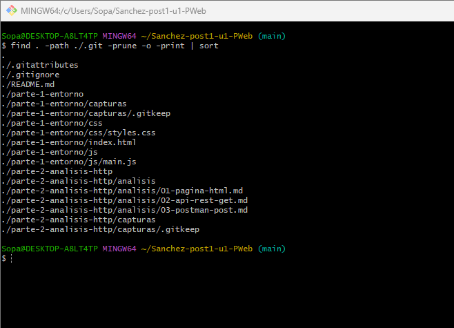

# Post-contenido — Unidad 1: Fundamentos de la Web

Nicolás Sánchez
Programación Web — Séptimo Semestre
Universidad de Santander (UDES), Cúcuta

## Descripción

Repositorio del laboratorio de la Unidad 1 de Programación Web. Contiene dos partes desarrolladas en el mismo repositorio: la configuración del entorno de desarrollo web con una página HTML inspeccionada en Chrome DevTools (`parte-1-entorno/`), y el análisis de peticiones HTTP reales con el panel Network y con Postman (`parte-2-analisis-http/`).

## Estructura del repositorio

```
Sanchez-post1-u1-PWeb/
├── parte-1-entorno/
│   ├── index.html
│   ├── css/styles.css
│   ├── js/main.js
│   └── capturas/
├── parte-2-analisis-http/
│   ├── analisis/
│   │   ├── 01-pagina-html.md
│   │   ├── 02-api-rest-get.md
│   │   └── 03-postman-post.md
│   └── capturas/
├── .gitignore
└── README.md
```

## Parte 1 — Entorno de desarrollo

Entorno configurado con Visual Studio Code (extensiones Live Server, Prettier, GitLens y ESLint), Git 2.45.1 con identidad global configurada, cuenta de GitHub y Google Chrome con DevTools. Sobre ese entorno se construyó una página HTML básica con hoja de estilos y script propio, que luego se inspeccionó en los paneles Elements, Console y Network del navegador.

### Instalación y ejecución

1. Clonar el repositorio:
   ```bash
   git clone https://github.com/NicolasSnchz/Sanchez-post1-u1-PWeb.git
   cd Sanchez-post1-u1-PWeb
   ```
2. Abrir la carpeta en Visual Studio Code.
3. Hacer clic derecho sobre `parte-1-entorno/index.html` y elegir **Open with Live Server**.
4. La página queda disponible en `http://127.0.0.1:5500/parte-1-entorno/index.html`.
5. Abrir DevTools con F12 para revisar el DOM en Elements, los mensajes de `main.js` en Console y el ciclo de carga en Network.

### Evidencias de la Parte 1

Extensiones instaladas en VS Code:



Verificación de Git y configuración global:



Repositorio clonado y commit inicial:



Página renderizada con Live Server:


Paneles Console y Elements de DevTools:


Historial de commits en GitHub:


## Parte 2 — Análisis de peticiones HTTP

Se documentaron cuatro peticiones reales capturadas con Chrome DevTools y Postman:

| # | Tipo | URL | Código |
|---|------|-----|--------|
| 1 | GET HTML | https://example.com | 200 OK |
| 2 | GET JSON (exitoso) | /posts/1 | 200 OK |
| 3 | GET JSON (fallido) | /posts/999 | 404 Not Found |
| 4 | POST JSON | /posts | 201 Created |

Los análisis completos, con headers, tiempos de carga y conclusiones, están en:

- [01-pagina-html.md](parte-2-analisis-http/analisis/01-pagina-html.md)
- [02-api-rest-get.md](parte-2-analisis-http/analisis/02-api-rest-get.md)
- [03-postman-post.md](parte-2-analisis-http/analisis/03-postman-post.md)

### Evidencias de la Parte 2

Estructura de carpetas del repositorio en VS Code:



Panel Network con la petición a example.com:


Petición GET a la API con respuesta 200 OK:


Petición GET a un recurso inexistente con respuesta 404:


Petición POST en Postman con respuesta 201 Created:


Tests de Postman aprobados:


## Herramientas utilizadas

- Visual Studio Code con Live Server, Prettier, GitLens y ESLint
- Git y GitHub
- Google Chrome con DevTools (paneles Elements, Console y Network)
- Postman (petición POST con tests automatizados)

## Conclusiones

Configurar el entorno completo desde cero deja claro que cada herramienta cubre una parte específica del trabajo: el editor para escribir, Git para versionar el avance y el navegador para verificar el resultado real. Inspeccionar la página con DevTools ayudó a entender que el HTML que se escribe y el DOM que se ve en Elements no son exactamente lo mismo, porque el navegador construye el árbol y los estilos van cayendo en cascada sobre él. La parte de análisis HTTP fue la más reveladora, ya que hasta ahora las peticiones eran algo invisible y verlas en el panel Network permitió entender de dónde salen los tiempos de carga y por qué el TTFB pesa tanto. Comparar una respuesta HTML con una respuesta JSON y una petición GET con una POST dejó claro que el protocolo es el mismo y que lo que cambia es la intención y el tipo de contenido. Los tests en Postman mostraron además que probar una API puede automatizarse en lugar de revisar cada respuesta a mano.
